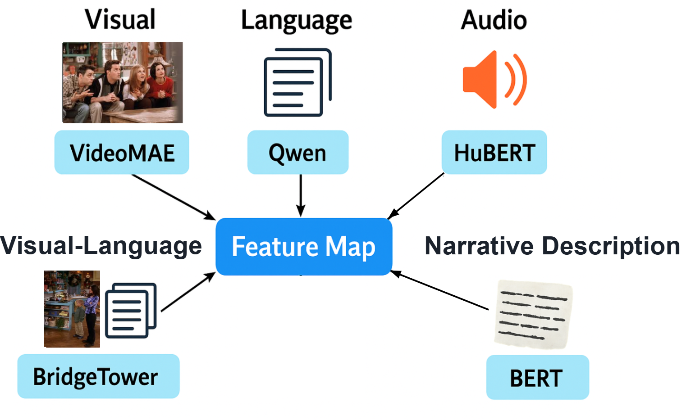

# Multimodal Seq2Seq Transformer for Brain Encoding

This repository contains the official implementation of our submission to the **Algonauts Project 2025 Challenge**, where the goal is to predict whole-brain fMRI responses to naturalistic multimodal movie stimuli.

## Report
The full technical report is available at:

## Overview

We propose a **sequence-to-sequence Transformer** that autoregressively generates fMRI signals from multimodal stimuli including:

-  **Video** (VideoMAE)
-  **Audio** (HuBERT)
-  **Language** (Qwen)
-  **Multimodal fusion** (BridgeTower)
-  **Episode summary** (BERT)

The model uses a masked Transformer encoder to process temporally aligned stimulus features, and a subject-adaptive decoder that attends to both stimulus and semantic-level memory to generate fMRI sequences over time.


## Requirements

We recommend using a virtual environment. Install dependencies with:

```bash
pip install -r requirements.txt
```

## Feature Extraction
Before training, extract multimodal features from the stimulus data:

```bash
# Language features using Qwen
python extract_qwen_features.py 

# Audio features using HuBERT
python extract_hubert_features.py 

# Visual features using VideoMAE
python extract_videomae_features.py

# Multimodal fusion using BridgeTower
python extract_bridgetower_features.py

# Episode-level semantic summary features using BERT
python extract_description_features.py
```
<div style="text-align: center;">
  
</div>

## Dataset Construction
After extracting features, build the fMRI training, validation, and test datasets:

```bash
python build_dataset.py
```
HDF5 and JSON files will be saved to the project root:

```pgsql
train_data.h5, train_data_meta.json
val_data.h5, val_data_meta.json
test_data.h5, test_data_meta.json
```
## Training
Train the multimodal encoder-decoder Transformer model:

```bash
python train_seq2seq_subject.py
```

Training loss includes both MSE and Pearson correlation loss. Model checkpoints will be saved under checkpoints/.

## Validation
Generate full-sequence predictions and compute validation correlation:

```bash
python val_corr.py
```
This script will:

- Generate predicted fMRI sequences on the validation set.

- Save .npy files to val_predictions/.

- Evaluate parcel-wise Pearson correlation for Friends and Movie10 clips.

## Visualization
Visualize the average encoding accuracy across all parcels:

```bash
python visualization.py
```
This will generate a glass brain image under val_parcel_corrs_* showing the average Pearson’s $r$ value across all subjects and parcels.

## Submission

Generate Codabench-compatible submission dictionary on the test set:

```bash
python submission.py
```

This will save:

```pgsql
friends_submission_dict_1.npy / ood_submission_dict_1.npy
```
This file contains predictions for all Season 7 episodes and OOD movies in the required nested dictionary format.

## Results

**Friens S7**


**OOD movies**


## Credits
This project was developed as part of the Algonauts 2025 Challenge using data from the Courtois NeuroMod project.
